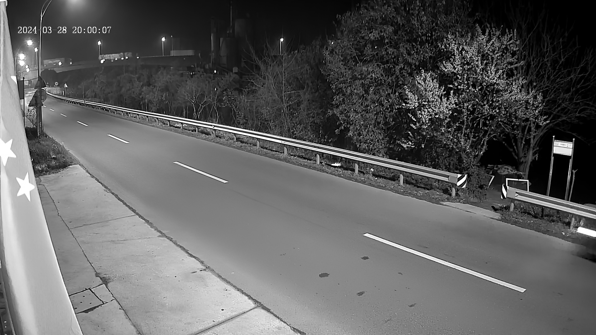

# Team Weekly [11.11- 17.11] - VN AI Team

Created: November 8, 2024 1:39 PM

# Work Summary:

## 1. Image Colorization

### Training colormnet

We trained ColorMNet with a dataset created from daylight videos, extracting the first 50 frames from each video. The dataset contains 42,691 videos in the test set and 10,674 videos in the training set.

Input

Reference

Result

Input

Reference

Result

Input

Reference

Result

Input

Reference

Result

**Issues:**

- **Global Color Transfer:** The model applies the overall color palette from the reference image to the input image without considering specific objects. This results in colors being applied to incorrect objects or areas in the input image.
- **Mismatched Object Positions:** Objects in the input image (such as the sofa, table, and person) are positioned differently compared to the reference image. The model fails to understand spatial relationships between the two images and transfers colors based solely on pixel similarity, disregarding object alignment.

Input

Reference

Result

**Solutions:**

- Implement a separate segmentation model or utilize pre-trained segmentation models to identify objects in both the input and reference images.
- Extract only the background with static objects and perform image colorization on these elements.

### Boosting DDColor inference speed on mobile with Guided Filter

Follow the same strategy of low light enhancement pipeline, with batch k=30

- Device: Redmi K70 Pro
- Inference framework: Onnx Runtime
- Input video: 150 frame - 10 seconds
- Running time: around **6 seconds**

**Some results:**

- DDColor with Guided Filter: **6 seconds for 150 frames**

- DDcolor only: **90 seconds for 150 frames**

- **Comment:** Applying guided filter **significantly reduces** the running speed for one video. However, this method has some drawbacks:
    - Flickering problem.
    - Cannot colorize moving objects.
    - The color is not as good as the original DDColor output.
    
    But these trade-offs are a “must” to achieve faster processing speed.
    

## 2. Infant Crying Detection

### Improving Model

***** Checkpoint: mobilev2-32bit-157-0.8278.pth**

***** Checkpoint: mobilev2-32bit-95-0.8755.pth**

- The FAR analysis of the “mobilev2-32bit-95-0.8755.pth “ - FAR 16.16%
    - Primary False Alarms (baby-related Sounds) - 43.75% (7/16)
    - Irregular noise (External sounds) - 31.25% (5/16)
    - Low-Amplitude Sounds - 25% (4/16)

-> **Despite adjustments, False Positives (FPs) remain a challenge. With 16 FPs now—mostly due to "10-type" noise, close to the original "12-type" noise—the improvements have helped but not eliminated the need for post-processing to reduce "alarm fatigue"**

**Perspective:**

- Establish a Strong Baseline with the FP32 Model
    - Since the quantized model’s FAR will generally exceed that of the FP32 model, **minimizing FAR in the FP32 version is essential**. Ensure the FP32 model **achieves an optimal balance of Sensibility, Miss Rate, and FAR** to serve as a lower bound for quantized models.
- Fine-Tune Post-Processing for Noise Types
    - Given that baby-related and low-amplitude noises are significant sources of FAR,  applying **post-processing filters** that reduce sensitivity specifically for these noise categories.
- Consider Higher Precision
    - **4-bit quantization** may be too aggressive, leading to loss of important information and increasing FAR. Using **8-bit quantization** instead can help retain more precision and potentially provide a more reliable balance between Sensibility and FAR in case that 4-bit model is still too overfitting after fine tuning parameters

### Audio Processing Pipeline C++:

- Build the C++ library - Torch/ Eigen3/ LibrosaCpp/Sndfile
- Convert Python pre-processing pipeline to C++ one
- Working on C++ pipeline processing conversion

### Issue:

# Next Week's Work Plan:

## 1. Image Colorization

| **Start Date** | **Finish Date** | **Duration** | **Milestone** | **Description** | **Target** |
| --- | --- | --- | --- | --- | --- |
| Nov 18th | Nov 24th | 1 weeks | Automatic Colorization Deployment | • Continue collaborate with Hangzhou team for deployment
• Convert the model to NCNN framework. | • Automatic Colorization model running  NCNN. |

## 2. Infant Crying Detection

| **Start Date** | **Finish Date** | **Duration** | **Milestone** | **Description** | **Target** |
| --- | --- | --- | --- | --- | --- |
| Nov 18th | Nov 24th | 1 week | ***Audio C++ pipeline conversion
***Optimization float model  | **Pre-processing audio pipeline in C++** Optimize float model *** Balance between False alarm rate - Miss Rate - Sensibility  | *** Audio pre-processing pipeline in C++ *** Specific FAR - MR - Sensibility of float model |

# Project Progress:

## 1. Image Colorization

- Automatic Colorization: Deployment in progress.
- **Target: Convert model to NCNN, because ONNX requires higher version of Android NDK → Takes more time to upgrade and testing → Try to convert to NCNN instead. Ref Liyb.**

| **Start Date** | **Finish Date** | **Duration** | **Milestone** | **Description** | **Target** |
| --- | --- | --- | --- | --- | --- |
| Nov 4th | Nov 10th | 1 weeks | Prepare reference dataset | • Prepare the dataset (pair daylight image and corresponding night image) | • Dataset for training and testing reference based colorization method |
| Nov 11th | Nov 17th | 1 weeks | Automatic Colorization Deployment | • Optimization and testing on video | **•** Reduce running time on video |
| **Nov 18th** | **Nov 24th** | **1 weeks** | **Automatic Colorization Deployment** | **** Continue collaborate with Hangzhou team for deployment **Convert the model to NCNN framework.** | **• Automatic Colorization model running  NCNN.** |
| Nov 25th | Dec 1st | 1 weeks | Training reference based colorization model (Pending) | • Run a baseline model and evaluate on our dataset | • Have a baseline model for comparison |

## 2. Infant Crying Detection

- Achieving the First prototype model which is compatible to the T31 board : MobileNetV2
- Propose the next month plan and at the end of the next month, **4-bit-quantized model with  FA20% on provided test set** is achieved

| **Start Date** | **Finish Date** | **Duration** | **Milestone** | **Description** | **Target** |
| --- | --- | --- | --- | --- | --- |
| Nov 4th | Nov 10th | 1 week | 4-bit-quantized model process  | **Collab with embedded team for testing proposed model. **Receive feedback to modify the model (if having any). **Fine-tune the model to require accuracy | - Test compatibility of 4 bit quantized model ~66% to current developing board |
| Nov 11th | Nov 17th | 1 week | Optimization → 8-bit quantization model | Retrain, evaluate,  reduce False Alarm Rate on FP32 model. **Balance between FAR -Sensibility and Miss Rate. **Train and evaluate 8-bit quantization model  | **FAR of FP32 model’s lower than 20%. **Proper FAR - Sensibility - Miss Rate. **Corresponding 8-bit quantization model  |
| Nov 18th | Nov 24th | 1 week | ***Audio C++ pipeline conversion
***Optimization float model  | **Pre-processing audio pipeline in C++** Optimize float model *** Balance between False alarm rate - Miss Rate - Sensibility  | *** Audio pre-processing pipeline in C++ *** Specific FAR - MR - Sensibility of float model |
| Nov 25th | Dec 1st | 1 week | ***Optimization → 4-bit quantization model 
***Final model for embedded team (magik format) | - Fine-tune model | 4-bit-quantized model with ~80%  on provided test set |