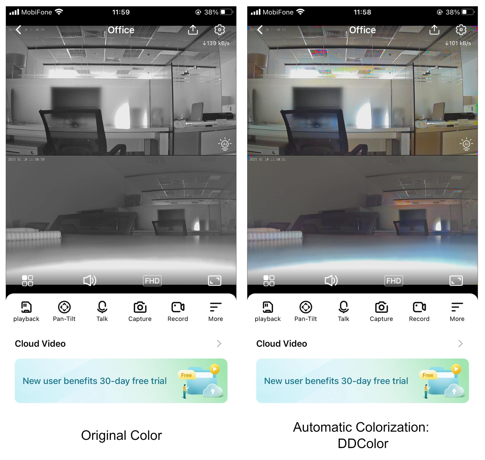
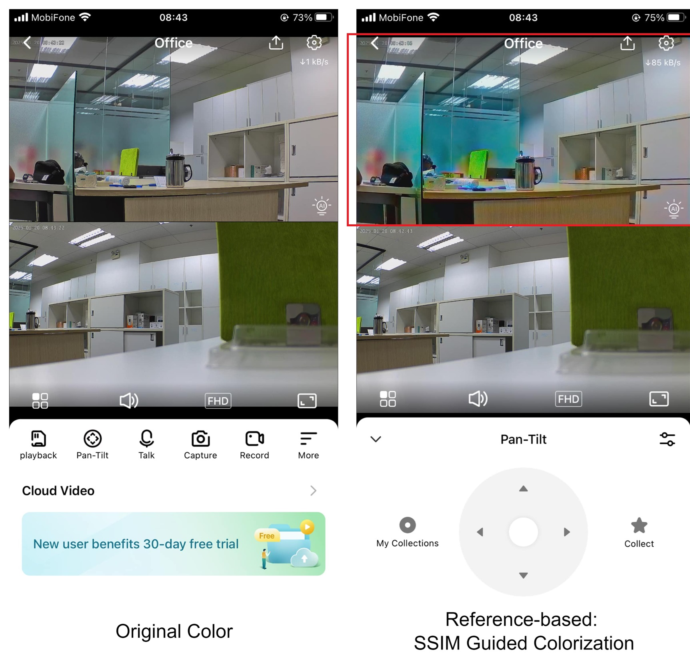
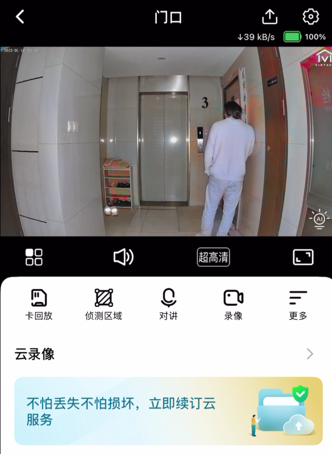
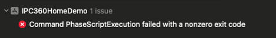
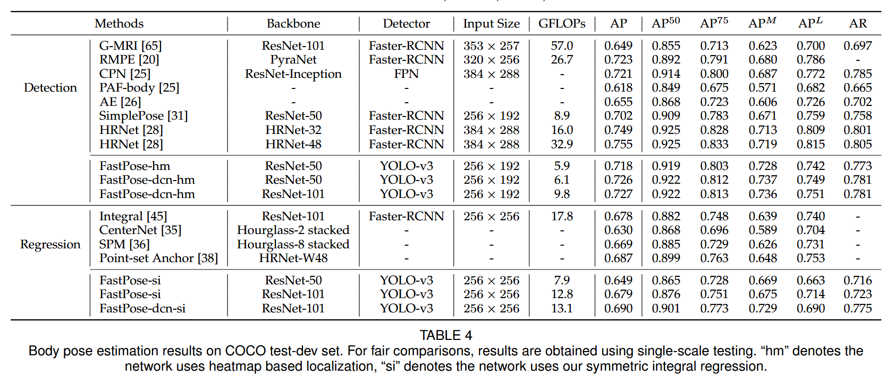

# Team Weekly [13.1- 19.1] - VN AI Team

Created: January 17, 2025 1:44 PM

# Work Summary:

## 1. Image Colorization

### Colorization demo

**Model: Automatic Colorization - DDColor**

**Model: Reference-based Colorization - SSIM Guided Colorization**

**Comment on the results:**

- Overall: Background colorization → OK.
- However, when there are moving objects, some issues persist:
    - Automatic Colorization: Color inconsistency between frames → due to noise + moving objects.
    - Reference-based Colorization: Over enhance → due to the color enhance during training.
    - Color residue: due to naive color transfer → optimized for background colorization, failed with moving objects.

**Next Step:**

- Automatic Colorization - resolving color inconsistency → background extraction
- Reference-based Colorization - over enhance: retrain the model.
- Resolving color residue: improving color transfer.

### Image alignment

Setting up the demo app  took more time than expected and still faced issue → Prioritizing the demo and improving the models to deliver another version.

## 2. Infant Crying Detection

### Model Deployment

- Successful deliver the base model to the embedded team for T32 board (onnx check point)

**Issue: ONNX2MAGIK conversion** 

- Collaborate with the chip vendor to handle this issue

### Fine-tuned Model:

Metric:

- Sensitivity: 95.88 

- FAR: 18.18 

- Miss Rate: 4.12

**Perspective:**

- Fine-Tune the model of expected metric:
    - Sensitivity > 90%
    - Miss Rate < 10%
    - FAR ~ 5%

## 3. Infant Rollover Detection:

1. Rollover Detection of Infants Using Posture  Estimation Model ([Link](https://www.ams.giti.waseda.ac.jp/data/pdf-files/2020_GCCE_okuno.pdf))
    
    → Cascaded Pyramid Network is better in infant pose estimation testing on 1101 images of infants sleeping on their backs
    
    → Proposed a method to detect infant rollover using the changes in coordinates of 2 shoulders after pose estimation.
    
2. Automatic infant 2D pose estimation from videos:  comparing seven deep neural network methods ([Link](https://arxiv.org/pdf/2406.17382))
    
    → The processing speed of AlphaPose and DeepLabCut is close to 30fps on GPU. ViT has the best accuracy, followed by HRNet
    
    → Present Object Keypoints Similarity (OKS) and Neck-MidHip Error for evaluation
    
3. AlphaPose: Whole-Body Regional Multi-Person  Pose Estimation and Tracking in Real-Time ([Link](https://arxiv.org/pdf/2211.03375))
    
    A real-time multi-person pose estimation network consists of a YOLOV3 detector and FastPose for pose estimation
    
    
    
    
    
4. Cascaded Pyramid Network for Multi-Person Pose Estimation ([Link](https://arxiv.org/pdf/1711.07319))
    
    They proposed a method using Feature Pyramid Network (FPN) with ROIAlign from Mask RCNN instead of the origin ROIPooling in FPN for the Human Detector task. Then using the Cascaded Pyramid Network (CPN) with two sub-networks: GlobalNet and RefineNet to address the problem of pose estimation
    
    
    

### Next Week's Work Plan:

## 1. Image Colorization

| **Start Date** | **Finish Date** | **Duration** | **Milestone** | **Description** | **Target** |
| --- | --- | --- | --- | --- | --- |
| Jan 20th | Jan 26th | 1 week | Optimizing models | Resolving the mentioned issues | The improved version of the models without/reducing the mentioned issues |

## 2. Infant Crying Detection

| **Start Date** | **Finish Date** | **Duration** | **Milestone** | **Description** | **Target** |
| --- | --- | --- | --- | --- | --- |
| **Jan 20th** | **Jan 26th** | **1 week** | **optimized model for T32**  | **Optimize the model to meet the expected metric** | **The optimized model** |

## 3. Infant Rollover Detection

| **Start Date** | **Finish Date** | **Duration** | **Milestone** | **Description** | **Target** |
| --- | --- | --- | --- | --- | --- |
| **Jan 20th** | **Jan 26th** | **1 week** | **Complete pipeline** | **An end-to-end progress demo of the infant rollover detection** | **Demo video** |

## 

# Project Progress:

## 1. Image Colorization

In progress:

- Optimize running time of the model.
- Resolving quantization issue.

Pending:

- Image alignment algorithm: Waiting for a demo app source code.

| **Start Date** | **Finish Date** | **Duration** | **Milestone** | **Description** | **Target** |
| --- | --- | --- | --- | --- | --- |
| Dec 30th | Jan 5th | 1 week | Optimize running time | Train light weight models for Reference Colorization, reduce running time, avoid color leaking. | Ref Color’s inference time reduces to <100ms (currently 420ms) |
| Jan 6th | Jan 12nd | 1 week | Optimize running time | Prepare dataset and  retrain light weight models for Automatic Colorization | Auto Color’s inference time reduces to <100ms (currently 320ms) |
| Jan 13th | Jan 19th | 1 week | Integrate the pipeline to the app | ** Optimize models ** Set up and testing the demo app | Pipeline with image alignment algorithm from the app |
| Jan 20th | Jan 26th | 1 week | ~~Improve the process~~ | ~~Improve the process if any issues arise~~ | ~~The improved version of the process~~ |
| **Jan 20th** | **Jan 26th** | **1 week** | **Optimizing models** | **Resolving the mentioned issues** | **The improved version of the models without/reducing the mentioned issues** |

## 2. Infant Crying Detection

- On progress of deploying model

| **Start Date** | **Finish Date** | **Duration** | **Milestone** | **Description** | **Target** |
| --- | --- | --- | --- | --- | --- |
| Dec 30th | Jan 5th | 1 week |  | **Collaborating and Debugging on the T31 board side |  |
| Jan 6th | Jan 12nd | 1 week | Re-implement on the new board T32 | Redo all procedure as the board T31  for T31 | Text model for checking alignment between Linux and the T32 board |
| Jan 13th | Jan 19th | 1 week | The adapted model to the T32 board | Modify the model to adapt on the T32  | The first demo on the T32 board |
| **Jan 20th** | **Jan 26th** | **1 week** | **optimized model for T32**  | **Optimize the model to meet the expected metric** | **The optimized model** |

## 3. Infant Rollover Detection

- On progress of completing the pipeline

| **Start Date** | **Finish Date** | **Duration** | **Milestone** | **Description** | **Target** |
| --- | --- | --- | --- | --- | --- |
| **Jan 20th** | **Jan 26th** | **1 week** | **Complete pipeline** | **An end-to-end progress demo of the infant rollover detection** | **Demo video** |