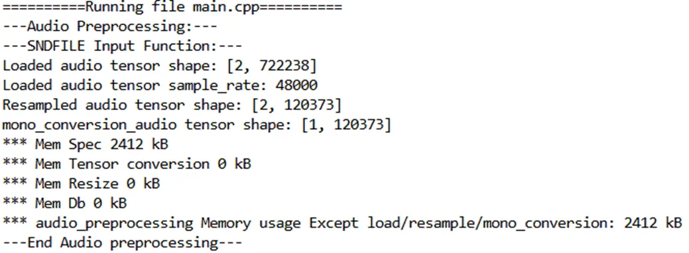

# Team Weekly [18.11- 25.11] - VN AI Team

Created: November 8, 2024 1:39 PM

# Work Summary:

## 1. Image Colorization

### Attempt to convert DDColor to NCNN framework

Previously, the conversion process was abruptly terminated without displaying any error message. Usually, when converting model, **pnnx** generates multiple `.py` files to convert the model from PyTorch to ONNX, PNNX, and NCNN. However, this did not happen with **DDColor** (as shown in the image below).

To address this, I broke down the model to identify potential issues and found two problems:

1. The model cannot be converted when **PyTorch hooks** are used.
2. **Spectral normalization** is not supported during the conversion process.

After resolving these two issues, I successfully ran the conversion process. However, I encountered another problem:

When testing the NCNN model, I received a **Segmentation Fault (core dumped)** error.

I looked up for the solution for this problem on pnnx github repo but many people faced the same situation and have not got a solution yet.

### DDColor OnnxRuntime optimization

Ref Liyb: The current model running ORT faces 2 problems:

- Long inference time
- High memory usage

In view of the previous problem of NCNN conversion, I decided to optimize the ONNX model.

Hypothesis 1: The model itself is big and takes much memory.

Hypothesis 2: Preprocessing and postprocessing take much memory.

Approach:

- Model quantization:
    - Pipeline: DDColor PyTorch → remove **Spectral normalization** → Onnx → Onnx sim → quantization **uint8**
    - Results: inference time reduces by **1.5 times**, memory usage reduces by **1.3 times**
    - Some notes:
        - Test device: Redmi K70 Pro (Snap 8 Gen 3)
        - fp16, int8, int4, uint4 failed to run on mobile.

| **Format** | **Inference Time** | **Mem Usage** |
| --- | --- | --- |
| FP32 (original) | 500ms | 1GB |
| **UInt8** | **320ms** | **730MB** |
- Optimizing preprocess and postprocess:
    - Move preprocess and postprocess into the model → Convert to ONNX and perform quantization (above pipeline)
    - Results: The inference time and memory usage remain unchanged (320ms, 730MB).

## 2. Infant Crying Detection

### Improving Model

-> **Despite adjustments, False Positives (FPs) remain a challenge. With 16 FPs now—mostly due to "10-type" noise, close to the original "12-type" noise—the improvements have helped but not eliminated the need for post-processing to reduce "alarm fatigue"**

**Perspective:**

- Establish a Strong Baseline with the FP32 Model
    - Since the quantized model’s FAR will generally exceed that of the FP32 model, **minimizing FAR in the FP32 version is essential**. Ensure the FP32 model **achieves an optimal balance of Sensibility, Miss Rate, and FAR** to serve as a lower bound for quantized models.
- Fine-Tune Post-Processing for Noise Types
    - Given that baby-related and low-amplitude noises are significant sources of FAR,  applying **post-processing filters** that reduce sensitivity specifically for these noise categories.
- Consider Higher Precision
    - **4-bit quantization** may be too aggressive, leading to loss of important information and increasing FAR. Using **8-bit quantization** instead can help retain more precision and potentially provide a more reliable balance between Sensibility and FAR in case that 4-bit model is still too overfitting after fine tuning parameters

### Audio Processing Pipeline C++:

- Audio processing v1 C++

- Audio processing v2 C++  (sent to embedded team)

Align with the computation capacity of T31 chips (4276 kB) 

### Issue:

# Next Week's Work Plan:

## 1. Image Colorization

| **Start Date** | **Finish Date** | **Duration** | **Milestone** | **Description** | **Target** |
| --- | --- | --- | --- | --- | --- |
| Nov 25th | Dec 1st | 1 weeks | *** Training reference based colorization model *** Automatic Colorization Deployment | ** Run a baseline model and evaluate on our dataset ** Search for any other possible ways to optimize the model  | ** Have a baseline model for comparison ** Reduce memory usage and inference time (if applicable) |

## 2. Infant Crying Detection

| **Start Date** | **Finish Date** | **Duration** | **Milestone** | **Description** | **Target** |
| --- | --- | --- | --- | --- | --- |
| Nov 25th | Dec 1st | 1 week | ***Optimization float model 
***Final model for embedded team (magik format) | ** Fine-tune model  ** collaborate with embedded team for checking audio processing pipeline **Running 1st demo on T31 board | ** first demo on T31 board |

# Project Progress:

## 1. Image Colorization

- Automatic Colorization: Deployment in progress --> Use ORT instead of NCNN.
- Target: Working on Reference-based Colorization, continue reduce memory usage and inference time of Automatic Colorization (if applicable)

| **Start Date** | **Finish Date** | **Duration** | **Milestone** | **Description** | **Target** |
| --- | --- | --- | --- | --- | --- |
| Nov 4th | Nov 10th | 1 weeks | Prepare reference dataset | • Prepare the dataset (pair daylight image and corresponding night image) | • Dataset for training and testing reference based colorization method |
| Nov 11th | Nov 17th | 1 weeks | Automatic Colorization Deployment | • Optimization and testing on video | **•** Reduce running time on video |
| Nov 18th | Nov 24th | 1 weeks | Automatic Colorization Deployment | ** Continue collaborate with Hangzhou team for deployment **Convert the model to NCNN framework. | • Automatic Colorization model running  NCNN. |
| **Nov 25th** | **Dec 1st** | **1 weeks** | ***** Training reference based colorization model *** Automatic Colorization Deployment** | **** Run a baseline reference based colorization  model and evaluate on our dataset ** Search for any other possible ways to optimize the automatic colorization model**  | **** Have a baseline reference based colorization model ** Reduce memory usage and inference time of the automatic colorization model (if applicable)** |

## 2. Infant Crying Detection

- Achieving the First prototype model which is compatible to the T31 board : MobileNetV2
- Propose the next month plan and at the end of the next month, **4-bit-quantized model with  FA20% on provided test set** is achieved

| **Start Date** | **Finish Date** | **Duration** | **Milestone** | **Description** | **Target** |
| --- | --- | --- | --- | --- | --- |
| Nov 4th | Nov 10th | 1 week | 4-bit-quantized model process  | **Collab with embedded team for testing proposed model. **Receive feedback to modify the model (if having any). **Fine-tune the model to require accuracy | - Test compatibility of 4 bit quantized model ~66% to current developing board |
| Nov 11th | Nov 17th | 1 week | Optimization → 8-bit quantization model | Retrain, evaluate,  reduce False Alarm Rate on FP32 model. **Balance between FAR -Sensibility and Miss Rate. **Train and evaluate 8-bit quantization model  | **FAR of FP32 model’s lower than 20%. **Proper FAR - Sensibility - Miss Rate. **Corresponding 8-bit quantization model  |
| Nov 18th | Nov 24th | 1 week | ***Audio C++ pipeline conversion
***Optimization float model  | **Pre-processing audio pipeline in C++** Optimize float model *** Balance between False alarm rate - Miss Rate - Sensibility  | *** Audio pre-processing pipeline in C++ *** Specific FAR - MR - Sensibility of float model |
| Nov 25th | Dec 1st | 1 week | ***Optimization float model 
***Final model for embedded team (magik format) | ** Fine-tune model  ** collaborate with embedded team for checking audio processing pipeline **Post-processing model **Running 1st demo on T31 board | ** first demo on T31 board |
