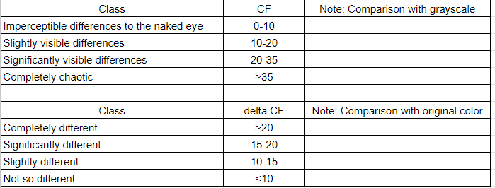

# Team Weekly [2.12- 8.12] - VN AI Team

Created: December 6, 2024 11:13 AM

# Work Summary:

## 1. Image Colorization

### Baseline Improvement: Color Blending

As discussed in last weekly report, our Reference-based Colorization performs well when the objects are aligned, but fails to colorize unfamiliar objects and human skin.

I propose a method to blend the DDColor and our Reference-based Colorization based on colorfulness map. The process is illustrated in the below image.

The technical detailed of Color Blending can be found via this link: [[Video Colorization] - Color Blending](https://www.notion.so/Video-Colorization-Color-Blending-1540c4b9a4568072823ae03726e6d3c3?pvs=21) 

I choose DDColor for Automatic Colorization and our previous Reference-based Colorization ConvNeXt

**Some results:**

Clarify on metrics: I simply divide the metrics into classes for **better interpretation.**

- **CF**: colorfulness score → the higher CF, the more colorful images the model generate → CF should be best in range 20-35, when it is too high, it does not reflect our video’s real color.
- **ΔCF:** measures the differences in colorfulness between the generated image and ground truth → the lower ΔCF, the more similar color the model generated.

** *NOTE: This is only my intuition based on experience with our video data. our video has very low colorfulness score, especially in low light environment.*

| **Model** | **CF ↑** | **ΔCF** ↓ |
| --- | --- | --- |
| Transfer Color | 25.58 | 11.56 |
| DDColor | **31.58** | 13.73 |
| Our Reference-based Colorization: ConvNeXt V2 | 25.92 | **10.68** |
| **Color Blending** | 30.55 | 10.96 |

## 2. Infant Crying Detection

### First Demo on T31 board:

- Model load successfully

- Successful audio pipeline on the board

### Fine-Tune model

> **Despite adjustments, False Positives (FPs) remain a challenge.  The improvements have helped but not eliminated the need for post-processing to reduce "alarm fatigue"**

**Perspective:**

- Fine-Tune Post-Processing for Noise Types
    - Given that baby-related and low-amplitude noises are significant sources of FAR,  applying **post-processing filters** that reduce sensitivity specifically for these noise categories.
- Consider Higher Precision
    - **4-bit quantization** may be too aggressive, leading to loss of important information and increasing FAR. Using **8-bit quantization** instead can help retain more precision and potentially provide a more reliable balance between Sensibility and FAR in case that 4-bit model is still too overfitting after fine tuning parameters

### Issue:

# Next Week's Work Plan:

## 1. Image Colorization

| **Start Date** | **Finish Date** | **Duration** | **Milestone** | **Description** | **Target** |
| --- | --- | --- | --- | --- | --- |
| Dec 9th | Dec 15th | 1 week | Reference-based Colorization: Deployment | ** Deploy the first version of Reference-based Colorization on mobile | ** First demo of Reference-based Colorization on mobile |

## 2. Infant Crying Detection

| **Start Date** | **Finish Date** | **Duration** | **Milestone** | **Description** | **Target** |
| --- | --- | --- | --- | --- | --- |
| Dec 9th | Dec 15th | 1 week | Measure the optimized model performance | **Collab with embedded team for deploying model on T31. **Post processing for handling “alarm fatigue” | ** The result of demo and post processing part  |

# Project Progress:

## 1. Image Colorization

- Done: Blending Color pipeline.
- Target: First demo of Reference-based Colorization on mobile.

| **Start Date** | **Finish Date** | **Duration** | **Milestone** | **Description** | **Target** |
| --- | --- | --- | --- | --- | --- |
| Dec 2nd | Dec 8th | 1 week | Reference-based Colorization: Improve baseline model | ** Improve the reference-based method | ** The improved version of the baseline. |
| **Dec 9th** | **Dec 15th** | **1 week** | **Reference-based Colorization: Deployment** | **** Deploy the first version of Reference-based Colorization on mobile** | **** First demo of Reference-based Colorization on mobile** |
| Dec 16th | Dec 22nd | 1 week | Reference-based Colorization: Deployment | ** Refine and optimize the model on mobile if any issues arise | ** The improved version of the model on mobile |
| Dec 23rd | Dec 29th | 1 week | Reference-based Colorization: Deployment | ** Refine and optimize the model on mobile if any issues arise | ** The improved version of the model on mobile |

## 2. Infant Crying Detection

- On progress of deploying model

| **Start Date** | **Finish Date** | **Duration** | **Milestone** | **Description** | **Target** |
| --- | --- | --- | --- | --- | --- |
| Dec 2nd | Dec 8th | 1 week | 1st demo on T31 board —> optimizing the board | **Collab with embedded team for testing proposed model. **Receive feedback to modify the model (if having any). **Fine-tune the model to require accuracy | ** first demo on T31 board |
| **Dec 9th** | **Dec 15th** | **1 week** | **Measure the optimized model performance** | ****Collab with embedded team for deploying model on T31. **Post processing for handling “alarm fatigue”** | **** The result of optimized model and post processing part**  |
| Dec 16th | Dec 22nd | 1 week |  |  |  |
| Dec 23rd | Dec 29th | 1 week |  |  |  |