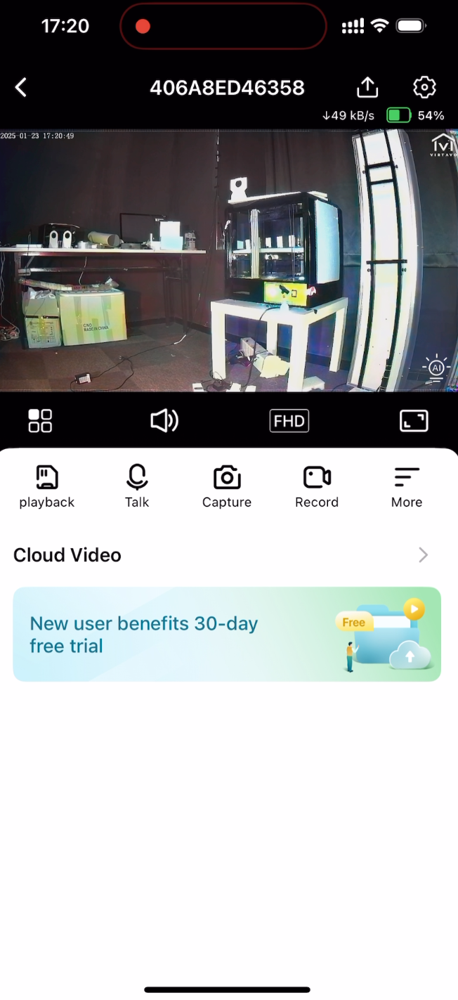

# Team Weekly [20.1- 26.1] - VN AI Team

Created: January 23, 2025 3:38 PM

# Work Summary:

## 1. Image Colorization

### Reducing Color Inconsistency

Automatic Colorization works well for static video. However, when there are moving objects, high level of noise, encoding artifacts,… the models gives different color between frames.

**Solution:** Applying a ‘relaxed’ background extraction for the colorization model.

- The purpose is to reduce the changes between video frames → reduce color inconsistency.
- but also taking into the changes for colorization → update the content of the frame.

Inspired by the idea of Exponential Moving Average, I propose using a simpler Accumulate Weighted function for video background extraction.

$$
background_{t} = \alpha * frame_{t} + (1-\alpha) * background_{t-1}
$$

This also helps partially reducing color residue.

**Some results:**

- Before: [before_1.mp4](https://drive.google.com/file/d/1Ee8ofSJCoTQQl1ePLk1-ivs-HD749OjB/view?usp=sharing) , [before_2.mp4](https://drive.google.com/file/d/1k4DuKDCDpkNU_T3ArUNA8EIRp7L5Q7fV/view?usp=sharing)
- After: [after_1.mp4](https://drive.google.com/file/d/1EvWg152z-tcUirP4n47SqXYJGunUc21A/view?usp=sharing) , [after_2.mp4](https://drive.google.com/file/d/1E5f_gbB3edMEUN1WXepJhUMG-u5SpBtn/view?usp=sharing)

### Reducing Color Distortion

- Retrain the SSIM Guided Colorization with less vibrant ground truth.
- Evaluation results:

| **Model** | **CF ↑** | **ΔCF** ↓ |
| --- | --- | --- |
| Transfer Color | 25.58 | 11.56 |
| DDColor | **31.58** | 13.73 |
| Ref-ConvNeXt (baseline) | 25.92 | 10.68 |
| Color Blending | 30.55 | 10.96 |
| SSIM Guided Color | 31.57 | 8.70 |
| **SSIM Guided Color-v2** | 28.06 | **7.85** |
- **Successfully convert and quantize SSIM Guided Colorization model and new Color Blending Pipeline.**

### New Color Blending Demo

- **Device:** Redmi K70 Pro (Snap 8 Gen 3)
- **Framework:** OnnxRuntime
- **Input size:** 1080x1920 → 128x128
- **Inference time:** Reduce from 710ms/frame to **100ms/frame (7 times)**, 4.4s for 150 frames (with Transfer Color)
- **Peak mem usage:** 370MB.
- **Some results:**

## 2. Infant Crying Detection

### Model Deployment

- Successful deliver the base model to the embedded team for T32 board (onnx check point)

**Successful handling ONNX2MAGIK conversion  Issue:** 

The transformed model: 

### Optimized Model:

Model: MobileNetV2

**Metric**:

- Sensitivity: 95.06

- FAR: 12.12

- Miss Rate: 4.94

**Perspective:**

- Fine-Tune the model of expected metric:
    - Sensitivity > 90%
    - Miss Rate < 10%
    - FAR ~ 5%
- Collaborate with the embedded team for deploying model on the board T32

## 3. Infant Rollover Detection:

Current Pipeline: 

- Input: Frame
- Output: Rollover signal

Frame → Detection layer → Pose estimation layer → get hips, shoulders, and nose → calculate rotation angle of infant and track shoulders movement → Detect Rollover at infants. 

This pipeline is based on research of this paper ([Link](https://www.ams.giti.waseda.ac.jp/data/pdf-files/2020_GCCE_okuno.pdf))

Demo video: 

- [Demo video 1](https://drive.google.com/file/d/1MRqf3j-n1CVbyo4e3vLwakwxEdp8mCVf/view?usp=sharing)
- [Demo video 2](https://drive.google.com/file/d/1a9tEiX8zvdmeP2EBKSzvPx4PEAX-uP32/view?usp=sharing)
- [Demo video 3](https://drive.google.com/file/d/1WPD7nKXplGxexSf5HBya8jDdZeHFXJY9/view?usp=sharing)

Successfully developed a simple pipeline for the project, but there are some pros of this solution:

- The noise when tracking the shoulders of infants makes the prediction wrong

→ Next week, research more for another pipeline to back up.

### Next Week's Work Plan:

## 1. Image Colorization

| **Start Date** | **Finish Date** | **Duration** | **Milestone** | **Description** | **Target** |
| --- | --- | --- | --- | --- | --- |
| 3rd Feb | 9th Feb | 1 week | Setting up + deployment | ** Continue setting the demo app ** Collaborate with iOS team for deployment |  |

## 2. Infant Crying Detection

| **Start Date** | **Finish Date** | **Duration** | **Milestone** | **Description** | **Target** |
| --- | --- | --- | --- | --- | --- |
| Feb 3rd | Feb 9th | 1 week |  | **Collaborating and Debugging on the T32 board side |  |

## 3. Infant Rollover Detection

| **Start Date** | **Finish Date** | **Duration** | **Milestone** | **Description** | **Target** |
| --- | --- | --- | --- | --- | --- |
| 3rd Feb | 9th Feb | 1 week | Research | Research for another pipeline to back up. Label data for Detection layer in current pipeline | Select three possible solutions for detection layer  |

# Project Progress:

## 1. Image Colorization

- In progress:
    - Image alignment algorithm.
    - 1st version deployment (iOS).

| **Start Date** | **Finish Date** | **Duration** | **Milestone** | **Description** | **Target** |
| --- | --- | --- | --- | --- | --- |
| 3rd Feb | 9th Feb | 1 week | Setting up + deployment | ** Continue setting the demo app ** Collaborate with iOS team for deployment | Done setting up + evaluate the process |
| 10th Feb | 23rd Feb | 2 week | Improve the process + deployment | Improve and optimize the alignment algorithm if any issue arises | Demo of the process |
| 24th Feb | 2nd Mar | 1 week | Integrate the process, testing + deployment | Integrate and test the process on our app | Image alignment algorithm + Colorization running on the app |

## 2. Infant Crying Detection

- On progress of deploying model T32

| **Start Date** | **Finish Date** | **Duration** | **Milestone** | **Description** | **Target** |
| --- | --- | --- | --- | --- | --- |
| **Feb 3rd** | **Feb 9th** | **1 week** |  | ****Collaborating and Debugging on the T32 board side** |  |
| Feb 10th | Feb 16th | 1 week |  |  |  |
| Feb 17th | Feb 23rd | 1 week |  |  |  |
| Feb 24th | Mar 2nd | 1 week |  |  |  |

## 3. Infant Rollover Detection

- On progress of completing the pipeline

| **Start Date** | **Finish Date** | **Duration** | **Milestone** | **Description** | **Target** |
| --- | --- | --- | --- | --- | --- |
| 3rd Feb | 9th Feb | 1 week | Research | Research for another pipeline to backup. Label data for Detection layer in current pipeline | Select three possible solutions for detection layer  |
| 10th Feb | 16th Feb | 1 week | Embedd Tools Implementation | Implement detection model to embededd tool | Get used to the embedded tool |
| 17th Feb | 23rd Feb | 1 week | Embedd Tools Implementation | Implement detection model to embededd tool | Implement Detection layer on embedded tool |
| 24th Feb | 2nd Mar | 1 week | Research | Evaluate HRNet and FastPose if it possible to implement on kit | Evaluation matrix of model, analyze pros and cons |