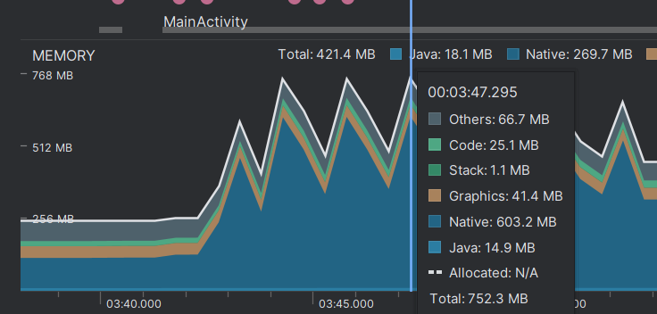
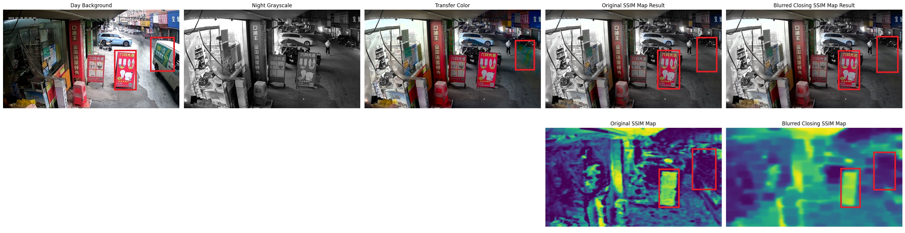

# Team Weekly [23.12- 29.12] - VN AI Team

Created: December 20, 2024 4:16 PM

# Work Summary:

## 1. Image Colorization

### Optimizing Model Inference Time

After training some lightweight models, inference time can be improved. However, the results of these models cannot match the performance of my previous ConvNeXt-Ref Colorization model (lacking generative ability, color leaking from the day background).

Therefore, I am developing another algorithm to help lightweight models minimize color leaking. My idea is inspired by the **SSIM metric**, which evaluates the structural similarity of two images. By calculating the **SSIM Map**, I use it as a mask to mask out the color of areas with differing structures.

SSIM Map Calculation Pipeline

Visual comparison between SSIM Map, Closing SSIM Map, and Blurred Closing SSIM Map

**Some initial results:**

**Next Step:** Integrate this idea to the light weight models and train on our dataset.

## 2. Infant Crying Detection

### First Demo on T31 board:

- **ISSUE : incorrect model inference → ON PROGRESS**

**Sample check alignment in development kit:**

**Model Loading check from Python and C++ in Linux** 

—> The issue definitely occurs during magik conversion and on the T31 side

### Fine-tuned Model:

Model train for loading in Linux

Wait for the latest Pipeline Alignment for optimization

**Perspective:**

- Fine-Tune Post-Processing for Noise Types
    - Given that baby-related and low-amplitude noises are significant sources of FAR,  applying **post-processing filters** that reduce sensitivity specifically for these noise categories.
- Consider Higher Precision
    - **4-bit quantization** may be too aggressive, leading to loss of important information and increasing FAR. Using **8-bit quantization** instead can help retain more precision and potentially provide a more reliable balance between Sensibility and FAR in case that 4-bit model is still too overfitting after fine tuning parameters
        
        **→ checked but still encountering the model inference issues**
        

### Issue:

# Next Week's Work Plan:

## 1. Image Colorization

| **Start Date** | **Finish Date** | **Duration** | **Milestone** | **Description** | **Target** |
| --- | --- | --- | --- | --- | --- |
| Dec 30th | Jan 5th | 1 week | Optimize running time | Train light weight models for Reference Colorization, reduce running time, avoid color leaking. | Ref Color’s inference time reduces to <100ms (currently 420ms) |

## 2. Infant Crying Detection

| **Start Date** | **Finish Date** | **Duration** | **Milestone** | **Description** | **Target** |
| --- | --- | --- | --- | --- | --- |
| Dec 30th | Jan 5th | 1 week |  | **Collaborating and Debugging on the T31 board side |  |

# Project Progress:

## 1. Image Colorization

In progress:

- Optimize running time of the model.

Pending:

- Image alignment algorithm: requested help from Liyb for an app to control camera for conducting experiments.

| **Start Date** | **Finish Date** | **Duration** | **Milestone** | **Description** | **Target** |
| --- | --- | --- | --- | --- | --- |
| **Dec 30th** | **Jan 5th** | **1 week** | **Optimize running time** | **Train light weight models for Reference Colorization, reduce running time, avoid color leaking.** | **Ref Color’s inference time reduces to <100ms (currently 420ms)** |
| Jan 6th | Jan 12nd | 1 week | Optimize running time | Prepare dataset and  retrain light weight models for Automatic Colorization | Auto Color’s inference time reduces to <100ms (currently 320ms) |
| Jan 13th | Jan 29th | 1 week | Integrate the pipeline to Liyb app | Integrate the pipeline for testing the process | Pipeline with image alignment algorithm from the app |
| Jan 20th | Jan 26th | 1 week | Improve the process | Improve the process if any issues arise | The improve version of the process |

## 2. Infant Crying Detection

- On progress of deploying model

| **Start Date** | **Finish Date** | **Duration** | **Milestone** | **Description** | **Target** |
| --- | --- | --- | --- | --- | --- |
| Dec 30th | Jan 5th | 1 week |  | **Collaborating and Debugging on the T31 board side |  |
|  |  |  |  |  |  |
|  |  |  |  |  |  |
|  |  |  |  |  |  |