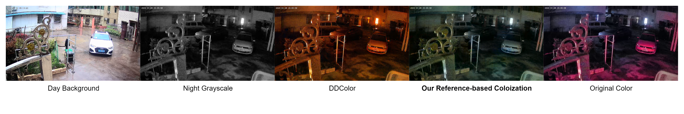

# Team Weekly [25.11- 1.12] - VN AI Team

Created: November 8, 2024 1:39 PM

# Work Summary:

## 1. Image Colorization

### Automatic colorization on mobile: Reduce memory usage

**Proposed method: Release memory on-the-fly**

OnnxRuntime allocates memory for all intermediate nodes of the model in advanced. This causes large memory usage even when the model is idle. To address this, I proposed to release the unused memory produced by ORT during inference.

**Result:**

- Without release on-the-fly: peak memory usage is **730MB**

- With release on-the-fly: peak memory usage is **540MB**, reduces **1.35 times.** Overall mem usage is only around **400MB.**

**Conclusion:** Applying UInt8 quantization + release on-the-fly, the memory usage reduces from 1GB to around **400MB (2.5 times)**, and the inference time reduces from 500ms to **320ms (1.3 times)** on Redmi K70 Pro - snap 8 gen 3.

### Reference-based Colorization: Train a baseline model

**Dataset:** 809 image pairs for training - 97 image pairs for testing.

Data Processing Pipeline

**Training:**

**Model:** ConvNeXt V2 Unet

**Input:** Day Lab image, Night L channel.

**Output:** Predicted Night ab_channels.

**Loss function:** Weighted loss of L2 and PatchGAN loss on ab_channel, with weight 1 and 0.01 respectively.

**Some results:**

Metrics: 

- **FID**: measures the distance between two distributions → the lower FID, the more similar images the model generate. However, this metric requires a large testset to be reliable → just for reference purpose.
- **CF**: colorfulness score → the higher CF, the more colorful images the model generate.
- **ΔCF:** measures the differences in colorfulness between the generated image and ground truth → the lower ΔCF, the more similar color the model generated.

| **Model** | **FID** ↓ | **CF ↑** | **ΔCF** ↓ |
| --- | --- | --- | --- |
| Transfer Color | **82.93** | 25.58 | 11.56 |
| DDColor | 115.51 | **31.58** | 13.73 |
| **Our Reference-based Colorization: ConvNeXt V2** | 83.12 | 25.92 | **10.68** |

Comparison with transfer color:

**Discussion:** While the results appear promising overall, the model shows limitations when handling human skin tones, unfamiliar objects, and cases where day and night images are not properly aligned.

## 2. Infant Crying Detection

### First Demo on T31 board:

- Successful Model load
- Audio processing pipeline C++
- Some issues arise from the embedded team :
    - Library doesn’t support “Torch library” —> done replace by opecnCV library
    - Overflow memory
    
    
    
    —> issue is fixed
    
    - **Segmentation fault issue —> on progress**
    
    
    
    
    

### Fine-Tune model

Still focus on fixing bug when inferencing on the T31 board

### Issue:

# Next Week's Work Plan:

## 1. Image Colorization

| **Start Date** | **Finish Date** | **Duration** | **Milestone** | **Description** | **Target** |
| --- | --- | --- | --- | --- | --- |
| Dec 2nd | Dec 8th | 1 weeks | Reference-based Colorization: Improve baseline model | ** Improve the referenced based method ** Collaborate with Hangzhou team to refine the dataset when needed | ** The improved version of the baseline. |

## 2. Infant Crying Detection

| **Start Date** | **Finish Date** | **Duration** | **Milestone** | **Description** | **Target** |
| --- | --- | --- | --- | --- | --- |
| Dec 2nd | Dec 8th | 1 week | 1st demo on T31 board —> optimizing the board | **Collab with embedded team for testing proposed model. **Receive feedback to modify the model (if having any). **Fine-tune the model to require accuracy | ** first demo on T31 board |

# Project Progress:

## 1. Image Colorization

- Done:
    - Automatic Colorization: optimized on mobile.
    - Reference-based Colorization: first baseline model.
- Target: Improving Reference-based Colorization model.

| **Start Date** | **Finish Date** | **Duration** | **Milestone** | **Description** | **Target** |
| --- | --- | --- | --- | --- | --- |
| **Dec 2nd** | **Dec 8th** | **1 week** | **Reference-based Colorization: Improve baseline model** | **** Improve the reference-based method** | **** The improved version of the baseline.** |
| Dec 9th | Dec 15th | 1 week | Reference-based Colorization: Deployment | ** Deploy the first version of Reference-based Colorization on mobile | ** First demo of Reference-based Colorization on mobile |
| Dec 16th | Dec 22nd | 1 week | Reference-based Colorization: Deployment | ** Refine and optimize the model on mobile if any issues arise | ** The improved version of the model on mobile |
| Dec 23rd | Dec 29th | 1 week | Reference-based Colorization: Deployment | ** Refine and optimize the model on mobile if any issues arise | ** The improved version of the model on mobile |

## 2. Infant Crying Detection

- On progress of deploying model

| **Start Date** | **Finish Date** | **Duration** | **Milestone** | **Description** | **Target** |
| --- | --- | --- | --- | --- | --- |
| **Dec 2nd** | **Dec 8th** | **1 week** | **1st demo on T31 board —> optimizing the board** | ****Collab with embedded team for testing proposed model. **Receive feedback to modify the model (if having any). **Fine-tune the model to require accuracy** | **** first demo on T31 board** |
| Dec 9th  | Dec 15th | 1 week |  |  |  |
| Dec 16th | Dec 22nd | 1 week |  |  |  |
| Dec 23rd | Dec 29th | 1 week |  |  |  |