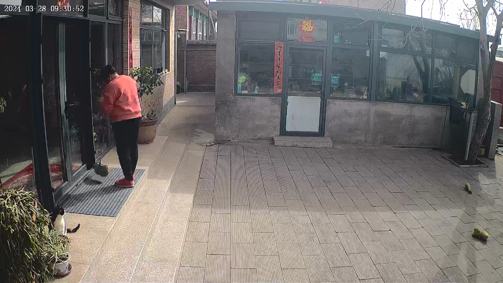

# Team Weekly [28.10 - 03.11] - VN AI Team

Created: November 1, 2024 8:38 AM

# Work Summary:

## 1. Image Colorization

### Train DDColor on the new dataset

- Training dataset: 110449 day images (first and last frame cut from every video in /home/share/datasets/cloud, filter out grayscale images)
- Some results:

- Comment:
    - After training the model with our dataset, it performs better in some areas where the original model struggled.
    - However, it still has issues like color bleeding and fails in many cases.
    - Overall, the result is not as impressive compared to the pretrained DDColor model.

### DeepRemaster: Temporal Source-Reference Attention Networks for Comprehensive Video Enhancement (SIGGRAPH Asia 2019)

The model was trained to perform denoising/restoration and colorization as the same time.

- **Input**: one noisy, grayscale video to be enhanced and many reference images.
- **Output**: a denoised, color video.
- **Some results**:

Reference Image 1

Reference Image 2

[Result (left: input grayscale - right: DeepRemaster result)](1312001008876325_1_comp_(1).mp4)

Result (left: input grayscale - right: DeepRemaster result)

- **Comment**: The model failed to generate the color.

### Issue:

## 2. Infant Crying Detection

### Working on Magik-toolkit_t31.zip

- Retest the examples for fixing the bug “can’t convert to magik file for T31 board”
- Summary the hangover from LE’s colorization task
- Select other models which are compatible to current library

### Select new model (MobileNetV2)

- Train new float model 32bit (MobileNetV2) which compatible to current library

### Issue:

# Next Week's Work Plan:

## 1. Image Colorization

| **Start Date** | **Finish Date** | **Duration** | **Milestone** | **Description** | **Target** |
| --- | --- | --- | --- | --- | --- |
| Nov 4th | Nov 10th | 1 weeks | Prepare reference dataset | • Prepare the dataset (pair daylight image and corresponding night image) | • Dataset for training and testing reference based colorization method |

## 2. Infant Crying Detection

| **Start Date** | **Finish Date** | **Duration** | **Milestone** | **Description** | **Target** |
| --- | --- | --- | --- | --- | --- |
| Nov 4th | Nov 10th | 1 week | 4-bit-quantized model | - Collab with embedded team for testing proposed model
- Receive feedback to modify the model (if having any)
- Fine-tune the model to require accuracy | - Test compatibility of 4 bit quantized model ~66% to current developing board |

# Project Progress:

## 1. Image Colorization

- Have the first prototype of Automatic Colorization model that can run relatively fast on mobile.
- Next month plan: continue working on Reference-based Colorization model.
- Target: Have the first prototype for Reference-based method.

| **Start Date** | **Finish Date** | **Duration** | **Milestone** | **Description** | **Target** |
| --- | --- | --- | --- | --- | --- |
| Nov 4th | Nov 10th | 1 weeks | Prepare reference dataset | • Prepare the dataset (pair daylight image and corresponding night image) | • Dataset for training and testing reference based colorization method |
| Nov 11th | Nov 17th | 1 weeks | Training reference based colorization model | • Run a baseline model and evaluate on our dataset | • Have a baseline model for comparison |
| Nov 18th | Nov 24th | 1 weeks | Refine and improvement | • Improve the referenced based method
• Collaborate with Hangzhou team to refine the dataset when needed | • Improve the baseline model on our testset with defined metrics |
| Nov 25th | Dec 1st | 1 weeks | Deploy on android | • Deploy automatic colorization model on Android | • First mobile app prototype for automatic colorization on android |

## 2. Infant Crying Detection

- Achieving the First prototype model which is compatible to the T31 board : MobileNetV2
- Propose the next month plan and at the end of the next month, **4-bit-quantized model with ~80%  on provided test set** is achieved

**Dataset v2: (15s)**

Training Ratio : 80%

In total: 

- Crying: 1213 samples
- Not Crying: 493 samples

Train

- Crying: 970 samples
- Not Crying: 394 samples

Test

- Crying: 243 samples
- Not Crying: 99 samples

Ref:

- Float model accuracy : 90% on test set
- 4-bit example for classification:  66% (magik-toolkit - provided by the vendor) on test set

| **Start Date** | **Finish Date** | **Duration** | **Milestone** | **Description** | **Target** |
| --- | --- | --- | --- | --- | --- |
| Nov 4th | Nov 10th | 1 week | 4-bit-quantized model | - Collab with embedded team for testing proposed model
- Receive feedback to modify the model (if having any)
- Fine-tune the model to require accuracy | - Test compatibility of 4 bit quantized model ~66% to current developing board |
| Nov 11th | Nov 17th | 1 week | Optimization | - Retrain model and evaluate its result | - Increase the accuracy to ~ 70% |
| Nov 18th | Nov 24th | 1 week | Optimization | - Optimize model and evaluate its result | - Increase the accuracy to ~ 75% |
| Nov 25th | Dec 1st | 1 week | Final model for embedded team (magik format) | - Fine-tune model | 4-bit-quantized model with ~80%  on provided test set |