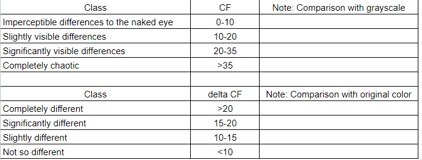

# Team Weekly [30.12- 5.1] - VN AI Team

Created: January 2, 2025 2:19 PM

# Work Summary:

## 1. Image Colorization

### Optimizing Model Inference Time: SSIM Guided Colorization

SSIM Map Calculation Pipeline

SSIM Map can help transfer color solve color leakage, but it still requires AI processing to **colorize the ‘over masked regions’** and **suppress the ‘under masked regions’**. 

Thus, I proposed a SSIM Guided Colorization pipeline. Taking a simple yet effective **Attention Guided mechanism** proposed in https://arxiv.org/abs/1906.06972, SSIM Map is resized and element-wise multiplied with every feature map. 

The model can be trained and deployed end-to-end with the SSIM Map calculation pipeline re-implemented in PyTorch.

SSIM Guided Colorization Model

**Results:** The new model outperforms our previous Ref-ConvNeXt on both evaluation metrics and running time. **Running time reduces from 420ms to 60ms.**

| **Model** | **CF ↑** | **ΔCF** ↓ |
| --- | --- | --- |
| Transfer Color | 25.58 | 11.56 |
| DDColor | **31.58** | 13.73 |
| Ref-ConvNeXt | 25.92 | 10.68 |
| Color Blending | 30.55 | 10.96 |
| **SSIM Guided Color** | 31.57 | **8.70** |

### **Running on Mobile**

- **Device:** Redmi K70 Pro (Snap 8 Gen 3)
- **Precision:** FP32
- **Input size:** 128x128
- **Inference time:** 60ms/frame (pre 20ms, model 20ms, post 20ms)
- **Mem usage:** 200MB
- **Some results:**

**Issue:** The model is running in FP32, UINT8 quantization gives wrong results → Currently looking for a way resolving this issue.

## 2. Infant Crying Detection

### Model Deployment

- Re-implement on the new board T32
- **ISSUE: Model conversion on the board T32 —> ON PROGRESS**

### Fine-tuned Model:

Updating the latest model deployment for optimization, which is aligned with the new board T32

**Perspective:**

- Fine-Tune Post-Processing for Noise Types
    - Given that baby-related and low-amplitude noises are significant sources of FAR,  applying **post-processing filters** that reduce sensitivity specifically for these noise categories.
- Consider Higher Precision
    - **4-bit quantization** may be too aggressive, leading to loss of important information and increasing FAR. Using **8-bit quantization** instead can help retain more precision and potentially provide a more reliable balance between Sensibility and FAR in case that 4-bit model is still too overfitting after fine tuning parameters
        
        **→ checked but still encountering the model inference issues**
        

### Infant Rollover Detection:

1. **Motion and Time Sequences of Roll-Overs During Sleep for Development of Self-Helped Roll-Over Movements: A Preliminary Study ([Link](https://www.jstage.jst.go.jp/article/jje/55/4/55_133/_pdf))**
2. **Rollover Detection of Infants Using Posture Estimation Model (L[ink](https://www.ams.giti.waseda.ac.jp/data/pdf-files/2020_GCCE_okuno.pdf))** 

### Next Week's Work Plan:

## 1. Image Colorization

| **Start Date** | **Finish Date** | **Duration** | **Milestone** | **Description** | **Target** |
| --- | --- | --- | --- | --- | --- |
| Jan 6th | Jan 12nd | 1 week | Optimize running time | ** Looking for resolve quantization issue ** Prepare dataset and  retrain light weight models for Automatic Colorization | Auto Color’s inference time reduces to <100ms (currently 320ms) |

## 2. Infant Crying Detection

| **Start Date** | **Finish Date** | **Duration** | **Milestone** | **Description** | **Target** |
| --- | --- | --- | --- | --- | --- |
| **Jan 6th** | **Jan 12nd** | **1 week** | Re-implement on the new board T32 | Redo all procedure as the board T31  | Text model for checking alignment between Linux and the T32 board |

# Project Progress:

## 1. Image Colorization

In progress:

- Optimize running time of the model.
- Resolving quantization issue.

Pending:

- Image alignment algorithm: Waiting for a demo app to control camera.

| **Start Date** | **Finish Date** | **Duration** | **Milestone** | **Description** | **Target** |
| --- | --- | --- | --- | --- | --- |
| Dec 30th | Jan 5th | 1 week | Optimize running time | Train light weight models for Reference Colorization, reduce running time, avoid color leaking. | Ref Color’s inference time reduces to <100ms (currently 420ms) |
| **Jan 6th** | **Jan 12nd** | **1 week** | **Optimize running time** | **Prepare dataset and  retrain light weight models for Automatic Colorization** | **Auto Color’s inference time reduces to <100ms (currently 320ms)** |
| Jan 13th | Jan 29th | 1 week | Integrate the pipeline to the app | Integrate the pipeline for testing the process | Pipeline with image alignment algorithm from the app |
| Jan 20th | Jan 26th | 1 week | Improve the process | Improve the process if any issues arise | The improve version of the process |

## 2. Infant Crying Detection

- On progress of deploying model

| **Start Date** | **Finish Date** | **Duration** | **Milestone** | **Description** | **Target** |
| --- | --- | --- | --- | --- | --- |
| Dec 30th | Jan 5th | 1 week |  | **Collaborating and Debugging on the T31 board side |  |
| **Jan 6th** | **Jan 12nd** | **1 week** | Re-implement on the new board T32 | Redo all procedure as the board T31  for T31 | Text model for checking alignment between Linux and the T32 board |
| Jan 13th | Jan 29th | 1 week | The adapted model to the T32 board | Modify the model to adapt on the T32  | The first demo on the T32 board |
| Jan 20th | Jan 26th | 1 week | optimized model for T32  | Optimize the model to meet the expected metric | The optimized model |