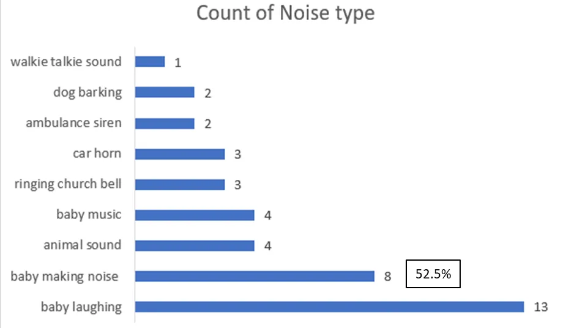
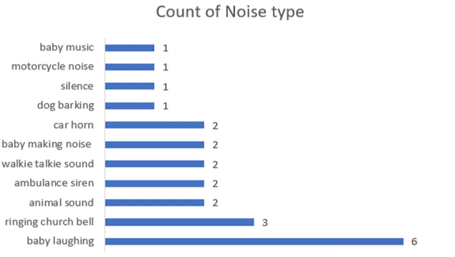

# Team Weekly [04.11 - 10.11] - VN AI Team

Created: November 4, 2024 8:48 AM

# Work Summary:

## 1. Image Colorization

### Prepare dataset for reference-based colorization

- **Source data:** 2626 day videos and  2275 night videos (in folders `/home/share/dataset/day_video` and `/home/share/dataset/night_video`).
- **Final Dataset**: 809 image pairs for training - 97 image pairs for testing.
- **Pipeline:**

Data Processing Pipeline

- **Details:**
    - Find intersection: Find a set of videos present in both day and night sets → **2234 videos**.
    - Check Static Video: Follow the algorithm [here](https://cs.stackexchange.com/questions/106230/computer-vision-algorithm-to-tell-if-camera-is-moving) to check for static camera view angles → **1882 videos**. (accuracy is not 100%)
    - Extract Background: For every static day video, uniformly get 30 frames and calculate the mean → **1882 background images**.
    - Extract first and last frame → **3764** **images**. Reasons:
        - They might have different content.
        - One might be infrared frame, the other might be RGB frame.
        - All videos have motions, thus the last frame is more stable when switching from infrared to RGB.
    - Split RGB and Infrared → **2398 night RGB images**.
    - Remove less colorful images: Utilize the colorfulness metric, remove all images < 20 score → **1062 night colorful RGB images.**
    - Denoise: Apply SCUNet for denoising → **1062 night colorful denoised RGB images.**
    - Train Test Split: Get the corresponding background of **1062 RGB images**, split training and testing dataset. Each day background only presents in one set. → **957 image pairs for training - 105 image pairs for testing**.
    - Manually remove images with issues (non-static, grayscale, blur, monotone color,…) → **809 image pairs for training - 97 image pairs for testing**.
- **Examples:**
    - Train set:
        
        
        
        
        
    - Test set:
        
        
        
        
        

### Issue:

## 2. Infant Crying Detection

### Collab with embedded team for testing proposed model

- Done via WeCom

### Float Model

- Improve False Alarm Rate (current float model 33.33%)

*** Checkpoint: mobilev2-32bit-144-0.8828.pth

**Comment:**

False Alarm Rate(FAR) Analysis:

- There are 3 types of False Alarms consisting of 12 types
- Primary False Alarms (baby-related Sounds) - 14/33 - 42.42%
    - 42% of FAR stems from baby itself, especially from sounds like laughing and general baby noises
- Irregular noise (External sounds) - 12/33 - 36.36%
    - car horns, motorcycle noise, ambulance sirens, and church bells, dog barking are considered irregular noises that could potentially be filtered or post-processed to minimize false alarms
- Low-Amplitude Sounds - 7/33 - 21.21%
    - Sounds like baby music, animal one , and walkie talkie ones, walking noise, silence are generally low in amplitude and may be less likely to trigger False Alarms, or they might need specific adjustments in sensitivity to prevent misinterpretation

### **8-Bit Quantization Model**

Comment: 

- The FAR and Miss Rate increase to 40% and 8.23%, respectively, while Sensibility decreases to 91.77%
- The FAR analysis of the “mobilev2-8bit-76-0.8315.pth “ - FAR 23.23%
    - Primary False Alarms (baby-related Sounds) - 52.5% (21/40)
    - Irregular noise (External sounds) - 25% (10/40)
    - Low-Amplitude Sounds - 39.13% (9/23)

### **4-Bit Quantization Model**

**Comment:**

- The FAR, Miss Rate and Sensibility are 52.53%, 2.47% and 97.53%, respectively:
    - FAR: 52.53% —far higher than desired and notably worse than the FP32 model.
- The FAR analysis of the “mobilev2-4bit-2-0.8248.pth “ - FAR 23.23%
    - Primary False Alarms (baby-related sounds) - 51.92% (27/52)
    - Irregular noise (External sounds) - 26.92% (14/52)
    - Low-Amplitude Sounds - 39.13% (47.82/23), indicating a sensitivity to lower-amplitude noises that aren’t true positives.
- Unreliable Sensibility Measurement:
    - The quantized model(INT4) shows an artificially high Sensibility at **97.53%**, but this is misleading because, at the start of quantization, the model over-classifies inputs as True Positives, leading to elevated FAR and misrepresentative Sensibility.

### Improving Model

***** Checkpoint: mobilev2-32bit-101-0.9084.pth and mobilev2-32bit-53-0.8901.pth**

**Comment:**

After tuning parameter, the model achieves better FAR (23.23% and 22.11%), but there are trade off between Sensibility, Miss Rate and FAR:

- FAR decrease leads to lower Sensibility and higher Miss Rate:
    - FAR: 33.33% - Sensibility: 97.12% and Miss Rate: 2.88% (mobilev2-32bit-144-0.8828.pth)
    - FAR: 23.23% - Sensibility: 96.3% and Miss Rate: 3.7% (mobilev2-32bit-101-0.9084.pth)
    - FAR :22.22% - Sensibility: 88.89% and Miss Rate: 11.11% (mobilev2-32bit-53-0.8901)

→ Need to **find a balance** between Sensibility and FAR depending on the application’s tolerance for missed detections versus false alarms.

→ If reducing FAR further is critical, accepting a higher Miss Rate might be necessary. However, if high Sensibility is more important, a slightly higher FAR may be acceptable.

- The FAR analysis of the “mobilev2-32bit-101-0.9084.pth “ - FAR 23.23%
    - Primary False Alarms (baby-related Sounds) - 34.78% (8/23)
    - Irregular noise (External sounds) - 39.13% (9/23)
    - Low-Amplitude Sounds - 26.09% (6/23)

Issue: 

- Minimizing FAR in the FP32 version
- Balance between FAR - Sensibility and Miss Rate
- Post processing for FAR

# Next Week's Work Plan:

## 1. Image Colorization

| **Start Date** | **Finish Date** | **Duration** | **Milestone** | **Description** | **Target** |
| --- | --- | --- | --- | --- | --- |
| Nov 11th | Nov 17th | 1 weeks | Training reference based colorization model | • Run a baseline model and evaluate on our dataset | • Have a baseline model for comparison |

## 2. Infant Crying Detection

| **Start Date** | **Finish Date** | **Duration** | **Milestone** | **Description** | **Target** |
| --- | --- | --- | --- | --- | --- |
| Nov 11th | Nov 17th | 1 week | Optimization → 8-bit quantization model | Retrain, evaluate,  reduce False Alarm Rate on FP32 model. **Balance between FAR -Sensibility and Miss Rate. **Train and evaluate 8-bit quantization model  | **FAR of FP32 model’s lower than 20%. **Proper FAR - Sensibility - Miss Rate. **Corresponding 8-bit quantization model  |

# Project Progress:

## 1. Image Colorization

- Automatic Colorization: Done (DDcolor)
- Reference-based Colorization Dataset V1: Done.
- Target: Build a baseline model and evaluate on Reference-based Colorization Dataset V1.

| **Start Date** | **Finish Date** | **Duration** | **Milestone** | **Description** | **Target** |
| --- | --- | --- | --- | --- | --- |
| Nov 4th | Nov 10th | 1 weeks | Prepare reference dataset | • Prepare the dataset (pair daylight image and corresponding night image) | • Dataset for training and testing reference based colorization method |
| **Nov 11th** | **Nov 17th** | **1 weeks** | **Training reference based colorization model** | **• Run a baseline model and evaluate on our dataset** | **• Have a baseline model for comparison** |
| Nov 18th | Nov 24th | 1 weeks | Refine and improvement | • Improve the referenced based method
• Collaborate with Hangzhou team to refine the dataset when needed | • Improve the baseline model on our testset with defined metrics |
| Nov 25th | Dec 1st | 1 weeks | Deploy on android | • Deploy automatic colorization model on Android | • First mobile app prototype for automatic colorization on android |

## 2. Infant Crying Detection

- Achieving the First prototype model which is compatible to the T31 board : MobileNetV2
- Propose the next month plan and at the end of the next month, **4-bit-quantized model with  FA20% on provided test set** is achieved

| **Start Date** | **Finish Date** | **Duration** | **Milestone** | **Description** | **Target** |
| --- | --- | --- | --- | --- | --- |
| Nov 4th | Nov 10th | 1 week | 4-bit-quantized model process  | **Collab with embedded team for testing proposed model. **Receive feedback to modify the model (if having any). **Fine-tune the model to require accuracy | - Test compatibility of 4 bit quantized model ~66% to current developing board |
| Nov 11th | Nov 17th | 1 week | Optimization → 8-bit quantization model | ** Retrain, evaluate,  reduce False Alarm Rate on FP32 model. **Balance between FAR -Sensibility and Miss Rate. **Train and evaluate 8-bit quantization model  | **FAR of FP32 model’s lower than 20%. **Proper FAR - Sensibility - Miss Rate. **Corresponding 8-bit quantization model  |
| Nov 18th | Nov 24th | 1 week | Optimization → 4-bit quantization model  | - Optimize model and evaluate its result  | - Increase the accuracy to ~ 75% |
| Nov 25th | Dec 1st | 1 week | Final model for embedded team (magik format) | - Fine-tune model | 4-bit-quantized model with ~80%  on provided test set |