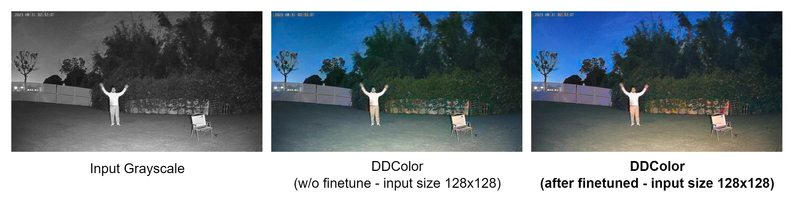
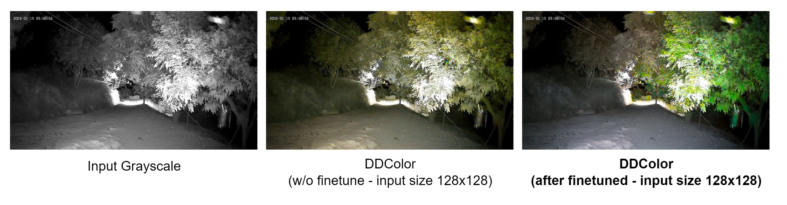
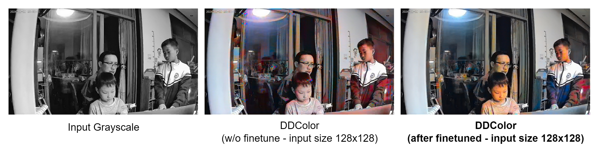
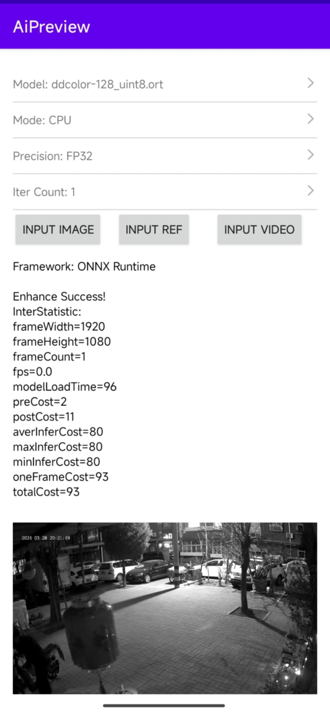
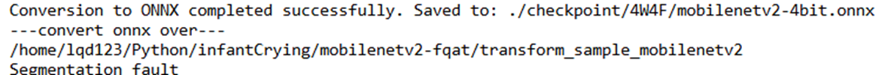

# Team Weekly [6.1- 12.1] - VN AI Team

Created: January 10, 2025 2:56 PM

# Work Summary:

## 1. Image Colorization

### Optimizing Model Inference Time: Retrain Automatic Colorization model

- Download ImageNet dataset
- Train/finetune approaches:
    - Train a new light weight model → reduces inference time but the results are not satisfied.
    - Finetune the existing model:
        - on ImageNet, input size 128x128
        - on our data, input size 128x128
        - **ImageNet + our data, input size 128x128**
- Some results:

### Running on mobile

New optimization: Convert .onnx to .ort format → reduces inference time ~20ms.

- **Device**: Redmi K70 Pro (Snap 8 Gen 3)
- **Framework**: OnnxRuntime with ORT format
- **Input size**: 1080x1920 → 128x128
- **Inference time**: ~100ms/frame **(reduces 3.2 times)**
- **Peak Memory Usage**: 350MB for video.

### Image Alignment:

- Collaborate with iOS developer team → Done the first demo app.
- Confidential issue → Waiting for permission on source code from the iOS team.

## 2. Infant Crying Detection

### Model Deployment

- Re-implement on the new board T32
- **ISSUE: Model conversion on the board T32 —> ON PROGRESS**

—> Define issue : on the chip vendor side —> wait for sufficient files from chip vendors —> the task: model conversion (ONNX2MAGIK) is taken charge by the embedded team 

### Fine-tuned Model:

- Modifying code regarding models, training-testing file, inference

**—> The target is to deliver to the embedded team ONNX check point**

- CNN 10 - modified load model before quantization:

**Perspective:**

- Fine-Tune Post-Processing for Noise Types
    - Given that baby-related and low-amplitude noises are significant sources of FAR,  applying **post-processing filters** that reduce sensitivity specifically for these noise categories.
- Consider Higher Precision
    - **4-bit quantization** may be too aggressive, leading to loss of important information and increasing FAR. Using **8-bit quantization** instead can help retain more precision and potentially provide a more reliable balance between Sensibility and FAR in case that 4-bit model is still too overfitting after fine tuning parameters
        
        **→ checked but still encountering the model inference issues**
        

### Infant Rollover Detection:

1. **Motion and Time Sequences of Roll-Overs During Sleep for Development of Self-Helped Roll-Over Movements: A Preliminary Study ([Link](https://www.jstage.jst.go.jp/article/jje/55/4/55_133/_pdf))** 
2. **Rollover Detection of Infants Using Posture Estimation Model (L[ink](https://www.ams.giti.waseda.ac.jp/data/pdf-files/2020_GCCE_okuno.pdf))** 

### Next Week's Work Plan:

## 1. Image Colorization

| **Start Date** | **Finish Date** | **Duration** | **Milestone** | **Description** | **Target** |
| --- | --- | --- | --- | --- | --- |
| Jan 13th | Jan 19th | 1 week | Integrate the pipeline to the app | ** Optimize models ** Set up and testing the demo app | Pipeline with image alignment algorithm from the app |

## 2. Infant Crying Detection

| **Start Date** | **Finish Date** | **Duration** | **Milestone** | **Description** | **Target** |
| --- | --- | --- | --- | --- | --- |
| **Jan 13th** | **Jan 19th** | **1 week** | **The adapted model to the T32 board** | **Modify the model to adapt on the T32** | **The first demo on the T32 board** |

# Project Progress:

## 1. Image Colorization

In progress:

- Optimize running time of the model.
- Resolving quantization issue.

Pending:

- Image alignment algorithm: Waiting for a demo app source code.

| **Start Date** | **Finish Date** | **Duration** | **Milestone** | **Description** | **Target** |
| --- | --- | --- | --- | --- | --- |
| Dec 30th | Jan 5th | 1 week | Optimize running time | Train light weight models for Reference Colorization, reduce running time, avoid color leaking. | Ref Color’s inference time reduces to <100ms (currently 420ms) |
| Jan 6th | Jan 12nd | 1 week | Optimize running time | Prepare dataset and  retrain light weight models for Automatic Colorization | Auto Color’s inference time reduces to <100ms (currently 320ms) |
| **Jan 13th** | **Jan 19th** | **1 week** | **Integrate the pipeline to the app** | **** Optimize models ** Set up and testing the demo app** | **Pipeline with image alignment algorithm from the app** |
| Jan 20th | Jan 26th | 1 week | Improve the process | Improve the process if any issues arise | The improved version of the process |

## 2. Infant Crying Detection

- On progress of deploying model

| **Start Date** | **Finish Date** | **Duration** | **Milestone** | **Description** | **Target** |
| --- | --- | --- | --- | --- | --- |
| Dec 30th | Jan 5th | 1 week |  | **Collaborating and Debugging on the T31 board side |  |
| Jan 6th | Jan 12nd | 1 week | Re-implement on the new board T32 | Redo all procedure as the board T31  for T31 | Text model for checking alignment between Linux and the T32 board |
| **Jan 13th** | **Jan 19th** | **1 week** | **The adapted model to the T32 board** | **Modify the model to adapt on the T32**  | **The first demo on the T32 board** |
| Jan 20th | Jan 26th | 1 week | optimized model for T32  | Optimize the model to meet the expected metric | The optimized model |