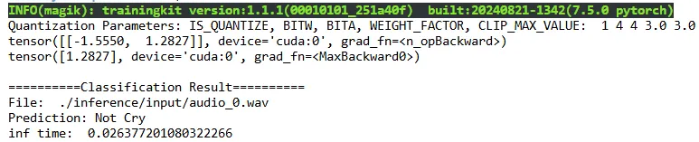

# Team Weekly [9.12- 15.12] - VN AI Team

Created: December 6, 2024 11:13 AM

# Work Summary:

## 1. Image Colorization

### Reference-based Colorization: First Demo on Mobile

- **Model**: Reference-based Colorization ConvNeXt UInt8
- **Device**: Redmi K70 Pro
- **Framework:** Onnx Runtime
- **Inference Time**: 420ms/frame, 7s for 150 frames (with Transfer Color)
- **Memory Usage**: 370MB for image, 480MB for video

**Some Results:** from top to bottom: Input grayscale, Day background as a reference → Colorized result

**Some Notes:**

- Preprocessing & Postprocessing are integrated into ONNX model to simplify the process. Inputs and Outputs all in RGB.
- Guided Filter damages the Colorization quality → good for Low Light Enhancement but not for Colorization → replace Guided Filter by Color Transfer, trade-offs: might causes color bleeding for moving objects, but since it is for background enhancement, I think it is acceptable for now.
- The inference time is relatively high even after quantization → this can be improved later.
- Color Blending is not yet available on mobile → next week work plan.

**Next Step:**

- Continue working on the demo and prepare for the next phase.

## 2. Infant Crying Detection

### First Demo on T31 board:

- **Value combination error when integrating audio processing pipeline with model loading module —> FIXED**

- **ISSUE: Mel Spectrogram computation error  —> FIXED**

- **ISSUE : Value alignment  on T31 board —> FIXED**

- **ISSUE : incorrect model inference → ON PROGRESS**

### Fine-tuned Model:

Wait for the latest Pipeline Alignment

**Perspective:**

- Fine-Tune Post-Processing for Noise Types
    - Given that baby-related and low-amplitude noises are significant sources of FAR,  applying **post-processing filters** that reduce sensitivity specifically for these noise categories.
- Consider Higher Precision
    - **4-bit quantization** may be too aggressive, leading to loss of important information and increasing FAR. Using **8-bit quantization** instead can help retain more precision and potentially provide a more reliable balance between Sensibility and FAR in case that 4-bit model is still too overfitting after fine tuning parameters
        
        **→ Can’t be inferenced on the T31 board**
        

### Issue:

# Next Week's Work Plan:

## 1. Image Colorization

| **Start Date** | **Finish Date** | **Duration** | **Milestone** | **Description** | **Target** |
| --- | --- | --- | --- | --- | --- |
| Dec 16th | Dec 22nd | 1 week | Reference-based Colorization: Deployment | ** Convert Color Blending pipeline to C++ on mobile | ** Color Blending demo on mobile |

## 2. Infant Crying Detection

| **Start Date** | **Finish Date** | **Duration** | **Milestone** | **Description** | **Target** |
| --- | --- | --- | --- | --- | --- |
| Dec 9th | Dec 15th | 1 week | Measure the optimized model performance | **Collab with embedded team for deploying model on T31. **Post processing for handling “alarm fatigue” | ** The result of demo and post processing part  |

# Project Progress:

## 1. Image Colorization

- Done: Automatic and Reference-based demo.
- In progress: Color Blending demo.
- Target: Fully functional Automatic, Reference-based, Color Blending on mobile.

| **Start Date** | **Finish Date** | **Duration** | **Milestone** | **Description** | **Target** |
| --- | --- | --- | --- | --- | --- |
| Dec 2nd | Dec 8th | 1 week | Reference-based Colorization: Improve baseline model | ** Improve the reference-based method | ** The improved version of the baseline. |
| Dec 9th | Dec 15th | 1 week | Reference-based Colorization: Deployment | ** Deploy the first version of Reference-based Colorization on mobile | ** First demo of Reference-based Colorization on mobile |
| **Dec 16th** | **Dec 22nd** | **1 week** | **Reference-based Colorization: Deployment** | **** Convert Color Blending pipeline to C++ on mobile** | **** Color Blending demo on mobile** |
| Dec 23rd | Dec 29th | 1 week | Reference-based Colorization: Deployment | ** Refine and optimize the model on mobile if any issues arise | ** The improved version of the model on mobile |

## 2. Infant Crying Detection

- On progress of deploying model

| **Start Date** | **Finish Date** | **Duration** | **Milestone** | **Description** | **Target** |
| --- | --- | --- | --- | --- | --- |
| Dec 2nd | Dec 8th | 1 week | 1st demo on T31 board —> optimizing the board | **Collab with embedded team for testing proposed model. **Receive feedback to modify the model (if having any). **Fine-tune the model to require accuracy | ** first demo on T31 board |
| **Dec 9th** | **Dec 15th** | **1 week** | **Measure the optimized model performance** | ****Collab with embedded team for deploying model on T31. **Post processing for handling “alarm fatigue”** | **** The result of optimized model and post processing part**  |
| Dec 16th | Dec 22nd | 1 week |  |  |  |
| Dec 23rd | Dec 29th | 1 week |  |  |  |